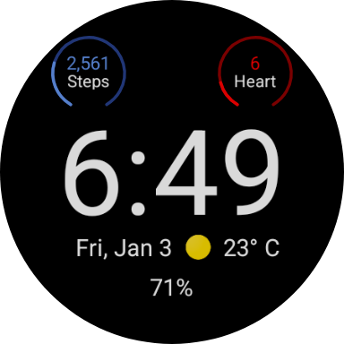
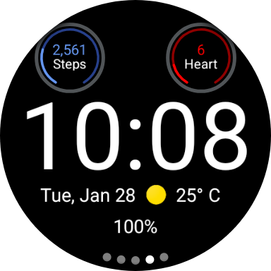
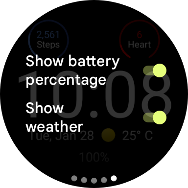

# Minimal Watch Face

Minimal Watch Face offers a sleek, customizable design for Wear OS. Enjoy a distraction-free experience with an intuitive, clean interface. Perfectly blending style, functionality, and efficiency for your smartwatch.

## Screenshots

|  |  |  |
| --------------------------------------------------------- | --------------------------------------------------------------------------- | ----------------------------------------------------------------- |

## Minimalist Design

A clean and customizable design that balances simplicity with functionality, providing a distraction-free experience. The minimalist aesthetic seamlessly adapts to any style, making it both practical and versatile.

## Customizable Display

Personalize your watch face with various color themes, complications, and optional information like the current weather or battery percentage.

## Modern, Performant & Efficient

Built using Google's watch face format, the watch face was designed from the ground up with a core focus on maximizing performance and battery efficiency.
